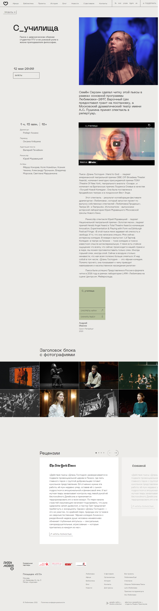

# Проект Любимовка

## Ссылка на макет:

- [ Проект Любимовка](https://www.figma.com/file/DEeW2FE3pJiQ407zqx4C9B/Lubimovka)

## Используемые технологии:
  - react.js
  - CSS

## Над проектом работали:
 - хэдер - [Пылаева Яна](https://github.com/IanaPylaeva)
 - описание пьесы - Пылаева Яна, Гудкова Мария
 - галерея - [Гудкова Мария](https://github.com/MariiaGudkova)
 - "рецензии" - [Рябцев Владимир](https://github.com/web77code)
 - отзывы зрителей, поделиться в соц.сетях - [Новиков Олег](https://github.com/pnzdmd)
 - футер, мобильное меню - [Никулина Дарья](https://github.com/N-Daria)

## Планы по доработке проекта: 
  - реализовать плавную адаптивность к разным расширениям экрана
  - добавить блок с отзывами зрителей
  - соединить мобильное и десктопное меню 

## Инструкция по развертыванию проекта: 
  - git clone https://github.com/pnzdmd/lubimovka.git
  - npm i
  - npm run start
